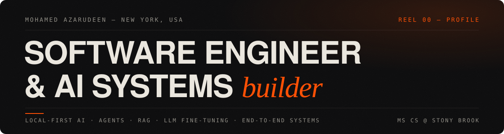

<picture>
  <source media="(prefers-color-scheme: light)" srcset="assets/banner-light.svg">
  
</picture>

 

I build AI systems **end to end** — the pipeline, the model integration, the API, and the interface it all lives in. The through-line in my work is **local-first AI**: agents, RAG with cited sources, and fine-tuned small models that run where the user lives, not in someone else's cloud.

MS COMPUTER SCIENCE @ STONY BROOK UNIVERSITY (AUG 2024 — MAY 2026) · RESEARCH & STUDENT ASSISTANT · NEW YORK

 

### `01` — SELECTED SYSTEMS

<table>
  <tr>
    <td width="50%" valign="top">
       
      <b><a href="https://github.com/AzaRKazar/AI-Powered-Investor-Intelligence-Platform">Investor Intelligence Platform</a></b>  
      Annual reports in, answers out — LLM KPI extraction with confidence-gated retries, plus hybrid keyword + vector RAG search over filings, on a live dashboard.  
      
      
      
      
      
    </td>
    <td width="50%" valign="top">
       
      <b><a href="https://github.com/AzaRKazar/support-ticket-triage-llm-finetuning">Support Ticket Triage — LLM Fine-tuning</a></b>  
      QLoRA fine-tune of Qwen2.5 / Llama-3.2 classifying support tickets across ~27 intents — 4-bit quantization + LoRA adapters, trained and tracked on Azure ML.  
      
      
      
      
    </td>
  </tr>
  <tr>
    <td width="50%" valign="top">
       
      <b><a href="https://github.com/AzaRKazar/earnings-call-evasiveness-detector">Earnings-Call Evasiveness Detector</a></b>  
      Fine-tuned small language model labeling executive answers <i>Direct / Partial / Evasive</i> on human-reviewed earnings-call transcript data.  
      
      
      
    </td>
    <td width="50%" valign="top">
       
      <b><a href="https://github.com/AzaRKazar/blog_to_podcast_agent">Blog → Podcast Agent</a></b>  
      Paste a URL, get a narrated episode — scraped, summarized by a local LLM, and voiced live, end to end, on a two-tier FastAPI + Next.js system.  
      
      
      
      
    </td>
  </tr>
  <tr>
    <td width="50%" valign="top">
       
      <b><a href="https://github.com/AzaRKazar/customer_support_voice_agent">Customer Support Voice Agent</a></b>  
      Local RAG support assistant with cited answers, hallucination safeguards, automatic ticket creation on low confidence, and spoken replies.  
      
      
      
      
    </td>
    <td width="50%" valign="top">
       
      <b><a href="https://github.com/AzaRKazar/github_mcp_agent">GitHub MCP Agent</a></b>  
      Explore and analyze any repository in natural language — an MCP GitHub server driven by fully local Ollama reasoning.  
      
      
      
    </td>
  </tr>
  <tr>
    <td width="50%" valign="top">
       
      <b><a href="https://github.com/AzaRKazar/ai_breakup_recovery_agent">AI Breakup Recovery Companion</a></b>  
      Privacy-first wellness app — four specialized local agents (Therapist, Closure, Routine Planner, Brutal Honesty), OCR chat-screenshot analysis, zero cloud calls.  
      
      
      
    </td>
    <td width="50%" valign="top">
       
      <b><a href="https://github.com/AzaRKazar/Athlete-Injury-Risk-Analyzer">Athlete Injury Risk Analyzer</a></b>  
      Biomechanical symmetry metrics → injury-risk classes; Random Forest compared across SMOTE / SMOTEENN and class weighting, with hypothesis testing.  
      
      
      
    </td>
  </tr>
</table>

 

### `02` — STACK

 

### `03` — STATS

 

### `04` — CONTRIBUTIONS, EATEN

<picture>
  <source media="(prefers-color-scheme: dark)" srcset="https://raw.githubusercontent.com/AzaRKazar/AzaRKazar/output/github-snake-dark.svg">
  
</picture>

 

LOCAL-FIRST AI · AGENTS · RAG · LLM FINE-TUNING · END-TO-END SYSTEMS — [azarkazar.github.io/mohamed-azar-portfolio](https://azarkazar.github.io/mohamed-azar-portfolio/)
